# Part 1. Инструмент ipcalc
### 1.1. Сети и маски
##### Определить и записать в отчёт:
##### 1) Адрес сети *192.167.38.54/13*

192.168.0.0
##### 2) <br/>
- маска *255.255.255.0*: префиксная /24 и двоичная 11111111.11111111.11111111.00000000,<br/>
- */15*: обычная 255.254.0.0 и двоичная 11111111.11111110.00000000.00000000,<br/> 
- *11111111.11111111.11111111.11110000*: обычная 255.255.255.240 и префиксная /28.
##### 3) Минимальный и максимальный хост в сети *12.167.38.4* при масках:<br/>
- */8* min: 12.0.0.1, max: 12.255.255.254  <br/>
- *11111111.11111111.00000000.00000000* min: 12.167.0.1, max: 12.167.255.254 <br/>
- *255.255.254.0*  min: 12.167.38.1, max: 12.167.39.254 <br/>
- */4 min: 0.0.0.1, max: 15.255.255.254*

### 1.2. localhost 
##### Определить и записать в отчёт, можно ли обратиться к приложению, работающему на localhost, со следующими IP:<br/>
Можно:
- *127.0.0.2*  
- *127.1.0.1* <br/> <br/>

Нельзя:
- 194.34.23.100
- 128.0.0.1

  > Диапазон: 127.0.0.1 - 127.255.255.255
### 1.3. Диапазоны и сегменты сетей
##### Определить и записать в отчёт:
##### 1) какие из перечисленных IP можно использовать в качестве публичного, а какие только в качестве частных:<br/>
Частные: 
- *10.0.0.45*
- *10.10.10.10*
- *172.16.255.255*
- *172.20.250.4*
- *192.168.4.2* <br/> <br/>
Публичные: 
- *134.43.0.2*<br/>
- *172.0.2.1*<br/>
- *172.68.0.2*<br/>
- *192.169.168.1*<br/>
- *192.172.0.1* <br/> <br/>
>Уполномоченной организацией по распределению нумерации в сети Интернет (IANA) специально для частных сетей зарезервированы следующие три блока IP-адресов:<br/>
10.0.0.0 — 10.255.255.255<br/>
172.16.0.0 — 172.31.255.255<br/>
192.168.0.0 — 192.168.255.255<br/>
##### 2) какие из перечисленных IP адресов шлюза возможны у сети *10.10.0.0/18*: <br/>
*10.10.0.2* <br/>
*10.10.10.10* <br/>
*10.10.1.255* <br/>
# Part 2. Статическая маршрутизация между двумя машинами
##### Поднять две виртуальные машины (далее -- ws1 и ws2)

##### С помощью команды `ip a` посмотреть существующие сетевые интерфейсы
- В отчёт поместить скрин с вызовом и выводом использованной команды.
 <br/> 

##### Описать сетевой интерфейс, соответствующий внутренней сети, на обеих машинах и задать следующие адреса и маски: <br/>
ws1 - *192.168.100.10*, маска */16* <br/>
ws2 - *172.24.116.8*, маска */12*
- В отчёт поместить скрины с содержанием изменённого файла *etc/netplan/00-installer-config.yaml* для каждой машины.
 <br/>

##### Выполнить команду `netplan apply` для перезапуска сервиса сети
- В отчёт поместить скрин с вызовом и выводом использованной команды.
 <br/>

### 2.1. Добавление статического маршрута вручную
##### Добавить статический маршрут от одной машины до другой и обратно при помощи команды вида `ip r add`
##### Пропинговать соединение между машинами
- В отчёт поместить скрин с вызовом и выводом использованных команд.
 <br/> <br/>
 <br/>
<br/> <br/>
 <br/> <br/>
 <br/>

### 2.2. Добавление статического маршрута с сохранением
##### Перезапустить машины
##### Добавить статический маршрут от одной машины до другой с помощью файла *etc/netplan/00-installer-config.yaml*
- В отчёт поместить скрин с содержанием изменённого файла *etc/netplan/00-installer-config.yaml*.
 <br/> <br/>
 <br/>
> Не забыть применить команду sudo netplan apply!
##### Пропинговать соединение между машинами
- В отчёт поместить скрин с вызовом и выводом использованной команды.
 <br/> <br/>
 <br/>

# Part 3. Утилита **iperf3**
### 3.1. Скорость соединения
##### Перевести и записать в отчёт: 
- 8 Mbps (Megabits per second) = 1 MB/s (Megabyte per second)
- 100 MB/s = 819200 Kbps (Kilobit per second)
- 1 Gbps (Gigabit per second) = 1024 Mbps

>Так как бит — минимальная единица, в наше время для измерения скорости интернета используют мегабиты в секунду (Мбит/с или Mbps). 
> 1024 бит = 1 килобит (Кбит). 1024 килобит = 1 мегабит (Мбит).

## 3.2. Утилита **iperf3**
##### Измерить скорость соединения между ws1 и ws2
- В отчёт поместить скрины с вызовом и выводом использованных команд.
   <br/> <br/>
   <br/>
## Part 4. Сетевой экран


#### 4.1. Утилита **iptables**
##### Создать файл */etc/firewall.sh*, имитирующий фаерволл, на ws1 и ws2:
```shell
#!/bin/sh

# Удаление всех правил в таблице "filter" (по-умолчанию).
iptables –F
iptables -X
```
##### Нужно добавить в файл подряд следующие правила:
##### 1) на ws1 применить стратегию когда в начале пишется запрещающее правило, а в конце пишется разрешающее правило (это касается пунктов 4 и 5)
##### 2) на ws2 применить стратегию когда в начале пишется разрешающее правило, а в конце пишется запрещающее правило (это касается пунктов 4 и 5)
##### 3) открыть на машинах доступ для порта 22 (ssh) и порта 80 (http)
##### 4) запретить *echo reply* (машина не должна "пинговаться”, т.е. должна быть блокировка на OUTPUT)
##### 5) разрешить *echo reply* (машина должна "пинговаться")
- В отчёт поместить скрины с содержанием файла */etc/firewall* для каждой машины.
 <br/>
 <br/>
##### Запустить файлы на обеих машинах командами `chmod +x /etc/firewall.sh` и `/etc/firewall.sh`
- В отчёт поместить скрины с запуском обоих файлов.
 <br/>
 <br/>
- В отчёте описать разницу между стратегиями, применёнными в первом и втором файлах.<br/>
Разница в том, что если сперва идет запрещающее правило, то оно не перезаписывается потом разрешающим правилом. <br/>
#### 4.2. Утилита **nmap**
##### Командой **ping** найти машину, которая не "пингуется", после чего утилитой **nmap** показать, что хост машины запущен
*Проверка: в выводе nmap должно быть сказано: `Host is up`*
- В отчёт поместить скрины с вызовом и выводом использованных команд **ping** и **nmap**.
 <br/>
 <br/>

## Part 5. Статическая маршрутизация сети
Сеть: \


##### Поднять пять виртуальных машин (3 рабочие станции (ws11, ws21, ws22) и 2 роутера (r1, r2))

### 5.1. Настройка адресов машин
##### Настроить конфигурации машин в *etc/netplan/00-installer-config.yaml* согласно сети на рисунке.
> Для роутера R1 делаем два дополнительных сетевых адаптера Internal Network в настройках VirtualBox с именами lan1 и lan2, а для роутера R2 с именами lan2 и lan3. 
> В остальных хостах меняем адаптеры с NAT на Internal Network с соответствующими именами (например, для хостов ws22 и ws21 это будет lan3)
- В отчёт поместить скрины с содержанием файла *etc/netplan/00-installer-config.yaml* для каждой машины.
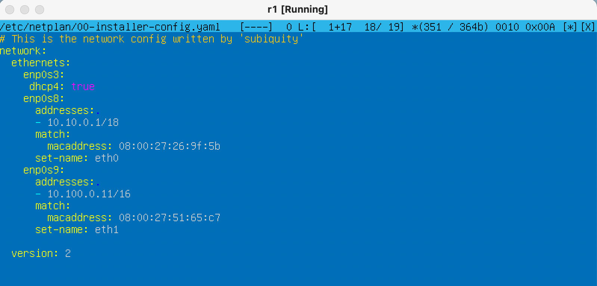 <br/>
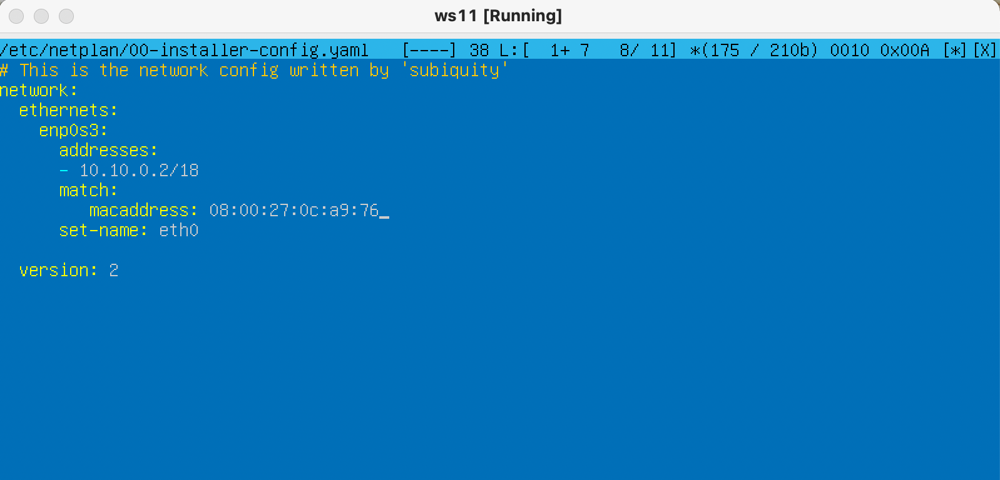 <br/>
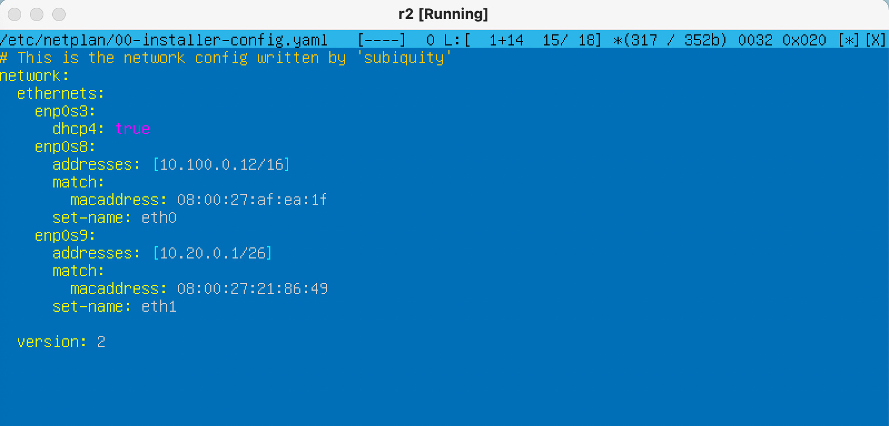 <br/>
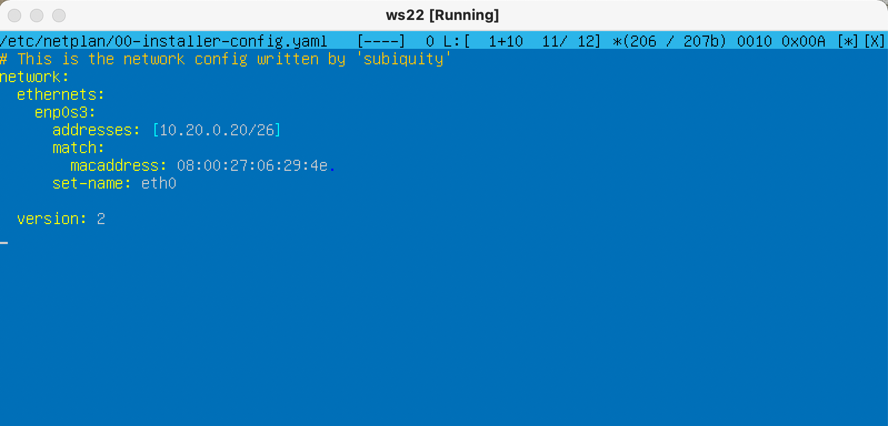 <br/>
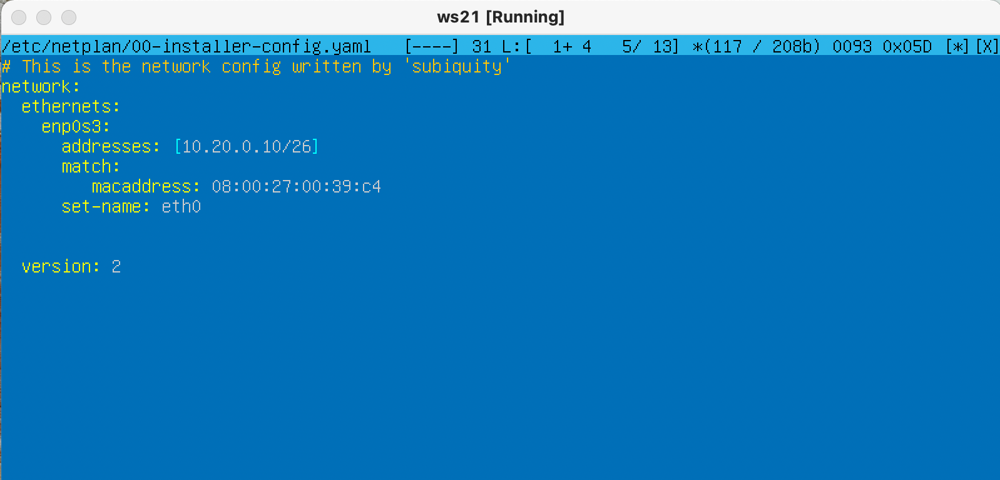 <br/>
##### Перезапустить сервис сети. Если ошибок нет, то командой `ip -4 a` проверить, что адрес машины задан верно. Также пропинговать ws22 с ws21. Аналогично пропинговать r1 с ws11.
- В отчёт поместить скрины с вызовом и выводом использованных команд.
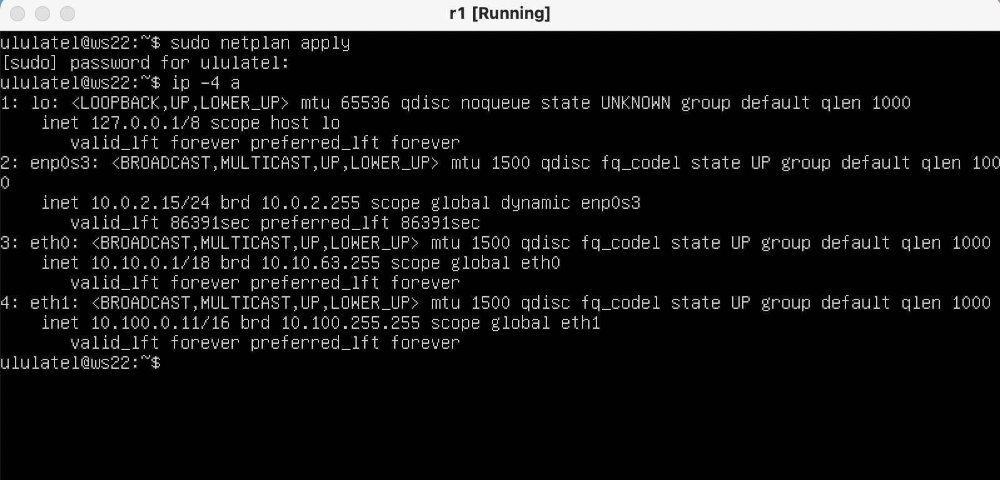 <br/>
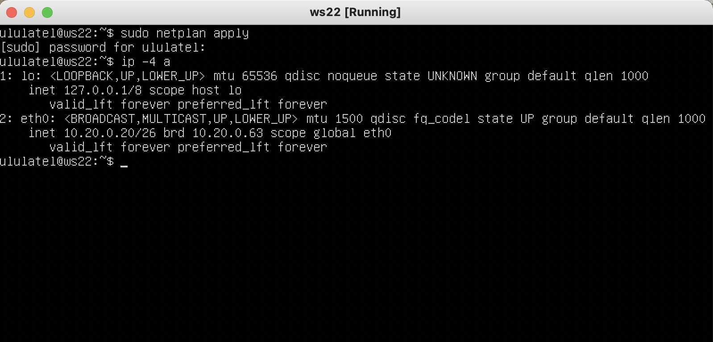 <br/>
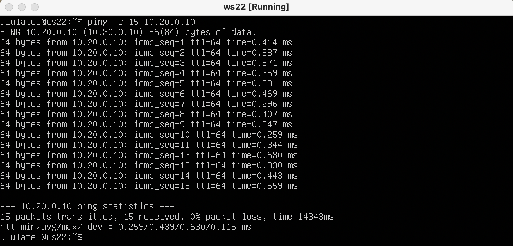 <br/>
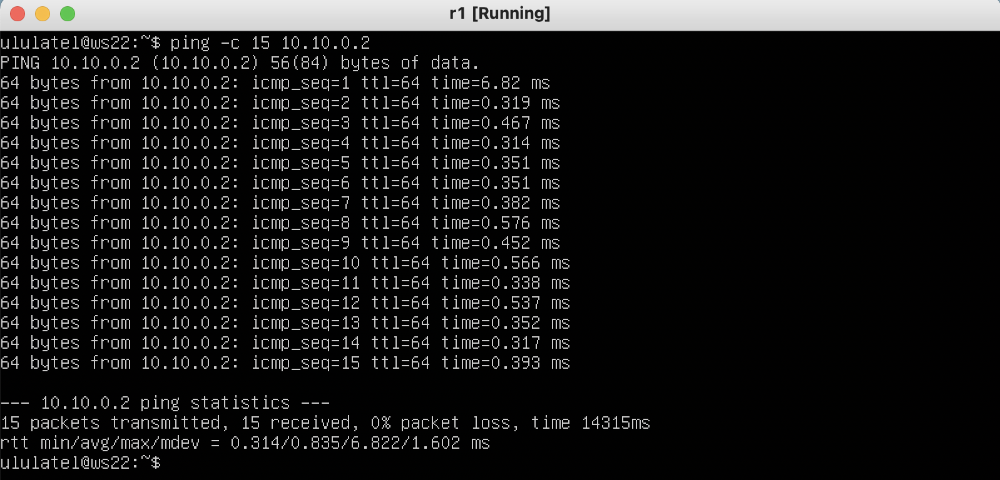 <br/>
#### 5.2. Включение переадресации IP-адресов.
> Переадресация IP-адресов нужна для того, чтобы сетевые устройства видели друг друга.
##### Для включения переадресации IP, выполните команду на роутерах:
`sysctl -w net.ipv4.ip_forward=1`
*При таком подходе переадресация не будет работать после перезагрузки системы.*
- В отчёт поместить скрин с вызовом и выводом использованной команды.
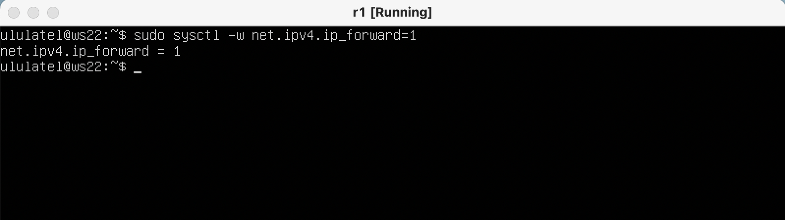 <br/>
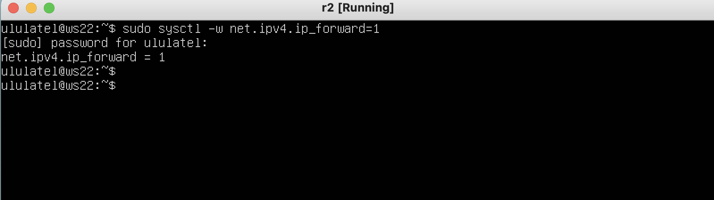 <br/>
##### Откройте файл */etc/sysctl.conf* и добавьте в него следующую строку:
`net.ipv4.ip_forward = 1`
*При использовании этого подхода, IP-переадресация включена на постоянной основе.*
- В отчёт поместить скрин с содержанием изменённого файла */etc/sysctl.conf*.
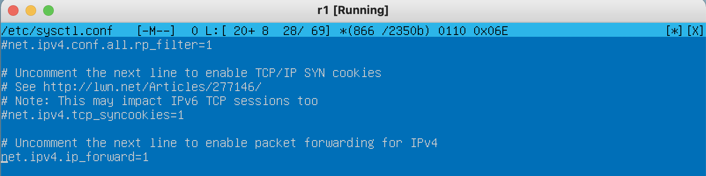 <br/>
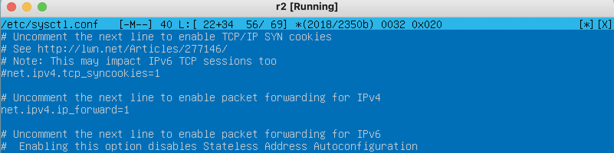 <br/>

#### 5.3. Установка маршрута по-умолчанию
Пример вывода команды `ip r` после добавления шлюза:
```
default via 10.10.0.1 dev eth0
10.10.0.0/18 dev eth0 proto kernel scope link src 10.10.0.2
```
 <br/>
 <br/>
 <br/>
 <br/>
 <br/>
##### Настроить маршрут по-умолчанию (шлюз) для рабочих станций. Для этого добавить gateway4 \[ip роутера\] в файле конфигураций
- В отчёт поместить скрин с содержанием файла *etc/netplan/00-installer-config.yaml*.
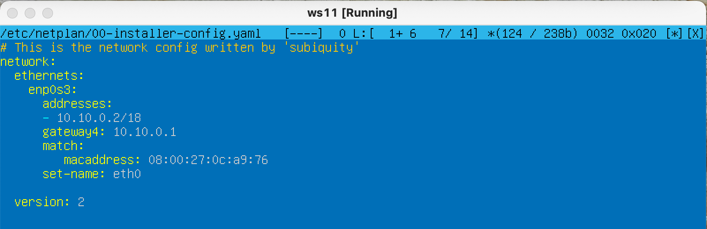 <br/>
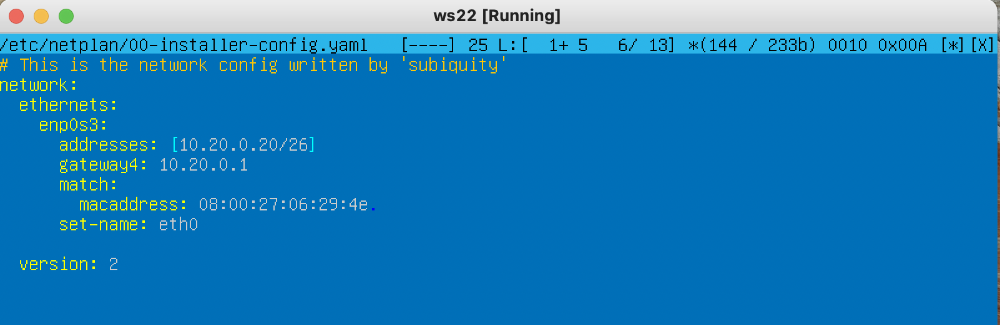 <br/>
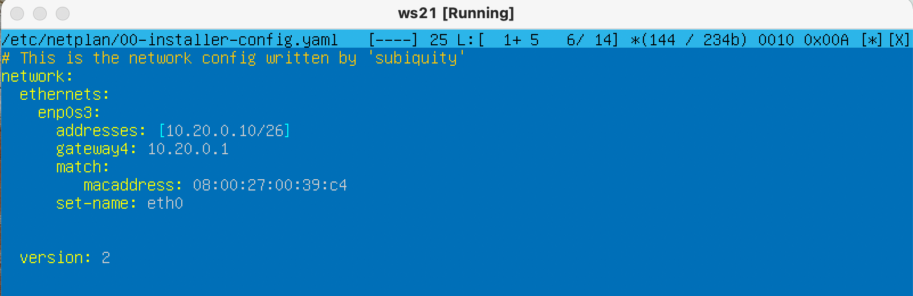 <br/>

##### Вызвать `ip r` и показать, что добавился маршрут в таблицу маршрутизации
- В отчёт поместить скрин с вызовом и выводом использованной команды.
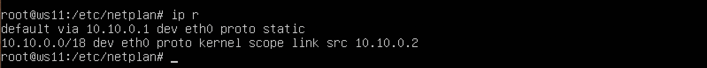 <br/>
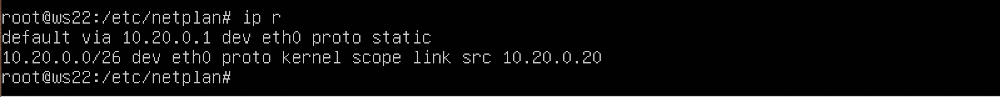 <br/>
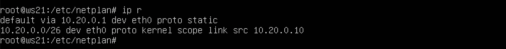 <br/>
##### Пропинговать с ws11 роутер r2 и показать на r2, что пинг доходит. Для этого использовать команду:
`tcpdump -tn -i eth1`
- В отчёт поместить скрин с вызовом и выводом использованных команд.
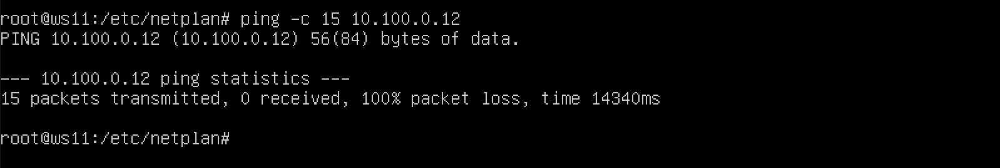 <br/>
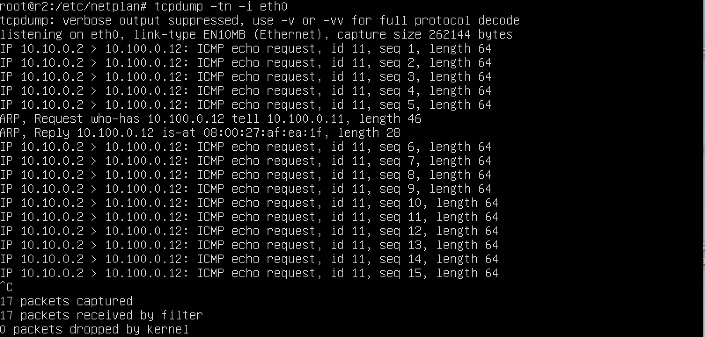 <br/>
#### 5.4. Добавление статических маршрутов
##### Добавить в роутеры r1 и r2 статические маршруты в файле конфигураций. Пример для r1 маршрута в сетку 10.20.0.0/26:
```shell
# Добавить в конец описания сетевого интерфейса eth1:
- to: 10.20.0.0
  via: 10.100.0.12
```
- В отчёт поместить скрины с содержанием изменённого файла *etc/netplan/00-installer-config.yaml* для каждого роутера.
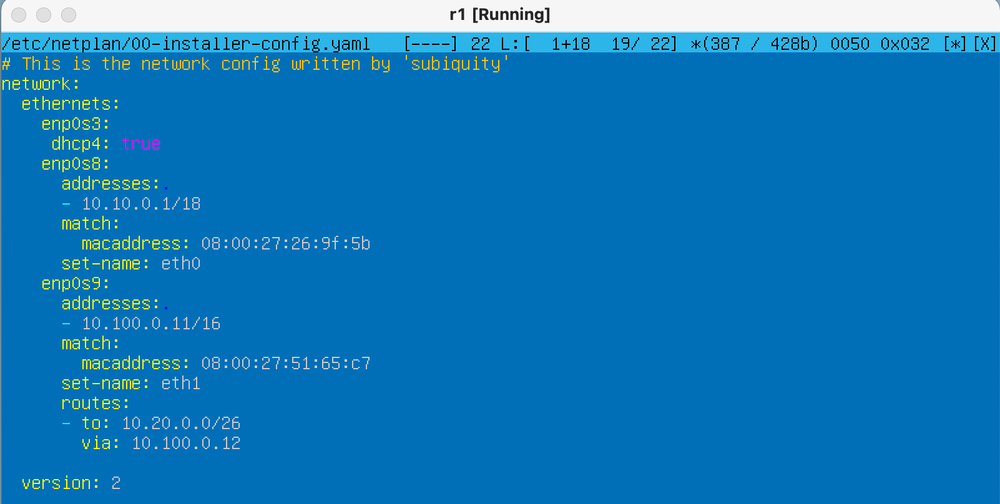 <br/>
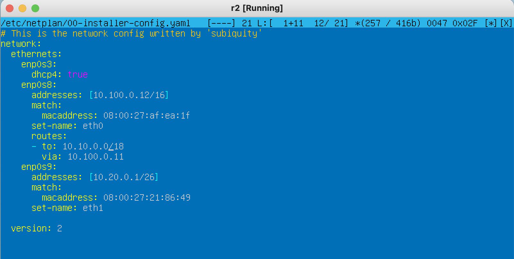 <br/>
##### Вызвать `ip r` и показать таблицы с маршрутами на обоих роутерах. Пример таблицы на r1:
```
10.100.0.0/16 dev eth1 proto kernel scope link src 10.100.0.11
10.20.0.0/26 via 10.100.0.12 dev eth1
10.10.0.0/18 dev eth0 proto kernel scope link src 10.10.0.1
```
- В отчёт поместить скрин с вызовом и выводом использованной команды.
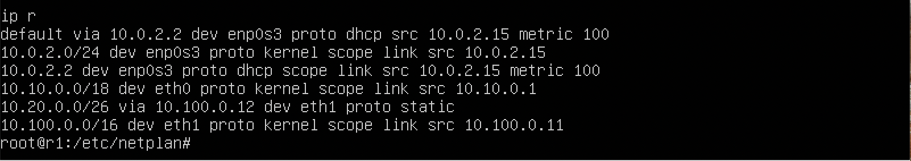 <br/>
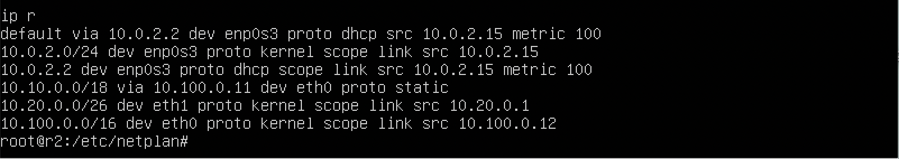 <br/>
##### Запустить команды на ws11:
`ip r list 10.10.0.0/[маска сети]` и `ip r list 0.0.0.0/0`
- В отчёт поместить скрин с вызовом и выводом использованных команд.
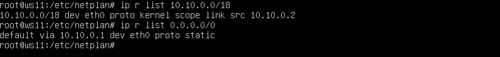 <br/>
- В отчёте объяснить, почему для адреса 10.10.0.0/\[порт сети\] был выбран маршрут, отличный от 0.0.0.0/0, хотя он попадает под маршрут по-умолчанию.<br/><br/>
Потому что маршрутизатор выбирает маршрут с самой длинной маской, так как это более точное решение. 
Согласно этому правилу, маршрут по умолчанию никогда не будет выбран, если есть альтернативные решения
#### 5.5. Построение списка маршрутизаторов
Пример вывода утилиты **traceroute** после добавления шлюза:
```
1 10.10.0.1 0 ms 1 ms 0 ms
2 10.100.0.12 1 ms 0 ms 1 ms
3 10.20.0.10 12 ms 1 ms 3 ms
```
##### Запустить на r1 команду дампа:
`tcpdump -tnv -i eth0`
##### При помощи утилиты **traceroute** построить список маршрутизаторов на пути от ws11 до ws21
- В отчёт поместить скрины с вызовом и выводом использованных команд (tcpdump и traceroute).
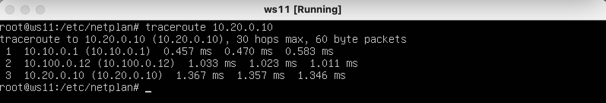 <br/>
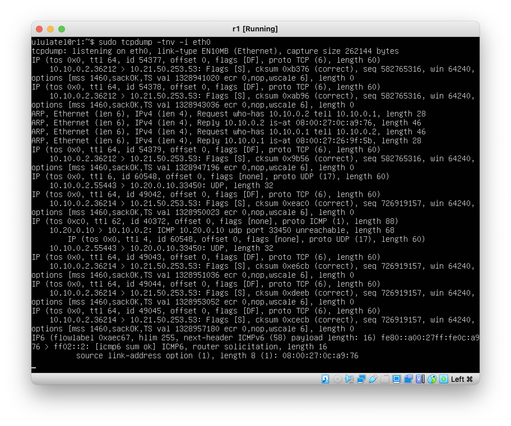

#### 5.6. Использование протокола **ICMP** при маршрутизации
##### Запустить на r1 перехват сетевого трафика, проходящего через eth0 с помощью команды:
`tcpdump -n -i eth0 icmp`
##### Пропинговать с ws11 несуществующий IP (например, *10.30.0.111*) с помощью команды:
`ping -c 1 10.30.0.111`
- В отчёт поместить скрин с вызовом и выводом использованных команд.
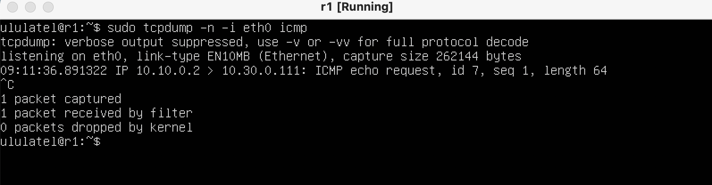 <br/>
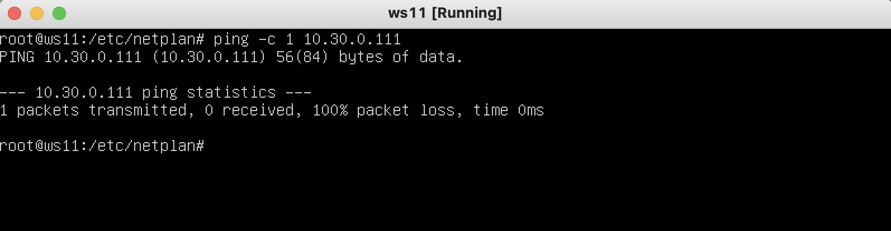


## Part 6. Динамическая настройка IP с помощью **DHCP**
>Для начала необходимо установить DHCP командой sudo apt install isc-dhcp-server <br/>
##### Для r2 настроить в файле */etc/dhcp/dhcpd.conf* конфигурацию службы **DHCP**:
##### 1) указать адрес маршрутизатора по-умолчанию, DNS-сервер и адрес внутренней сети. Пример файла для r2:
```shell
subnet 10.100.0.0 netmask 255.255.0.0 {}

subnet 10.20.0.0 netmask 255.255.255.192
{
    range 10.20.0.2 10.20.0.50;
    option routers 10.20.0.1;
    option domain-name-servers 10.20.0.1;
}
```
##### 2) в файле *resolv.conf* прописать `nameserver 8.8.8.8.`
- В отчёт поместить скрины с содержанием изменённых файлов.
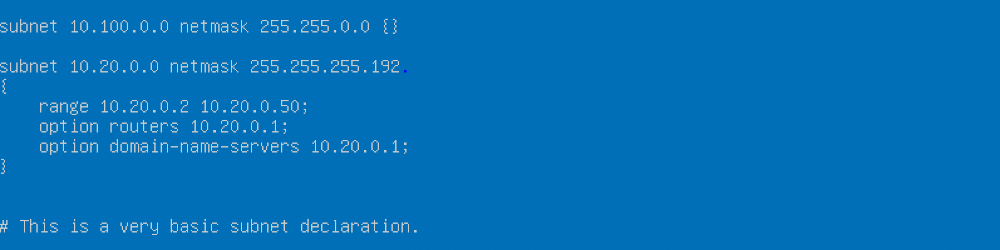

##### Перезагрузить службу **DHCP** командой `systemctl restart isc-dhcp-server`. Машину ws21 перезагрузить при помощи `reboot` и через `ip a` показать, что она получила адрес. Также пропинговать ws22 с ws21.
- В отчёт поместить скрины с вызовом и выводом использованных команд.
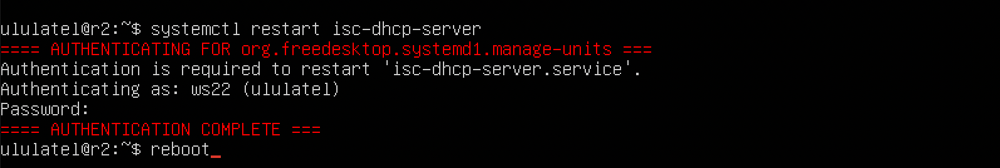
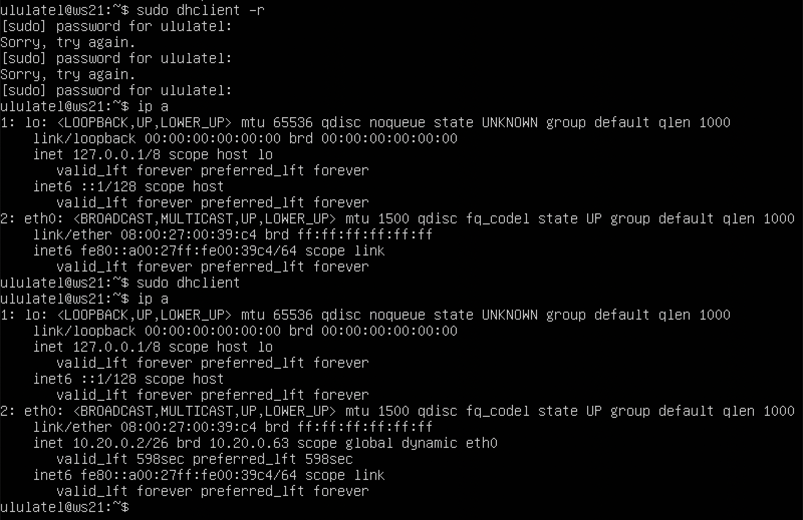
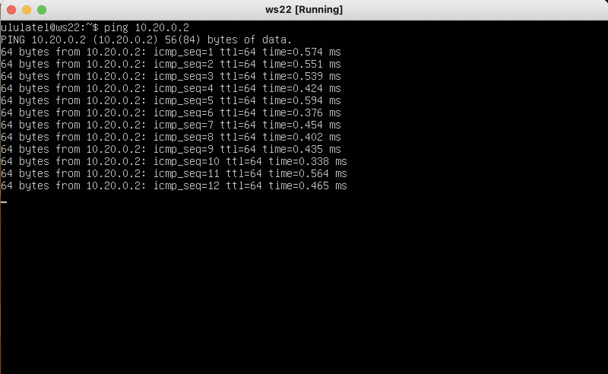
> Чтобы получить новый ip адрес, необходимо выполнить две команды $ sudo dhclient -r и <br/>
> $ sudo dhclient
##### Указать MAC адрес у ws11, для этого в *etc/netplan/00-installer-config.yaml* надо добавить строки: `macaddress: 10:10:10:10:10:BA`, `dhcp4: true`
- В отчёт поместить скрин с содержанием изменённого файла *etc/netplan/00-installer-config.yaml*.
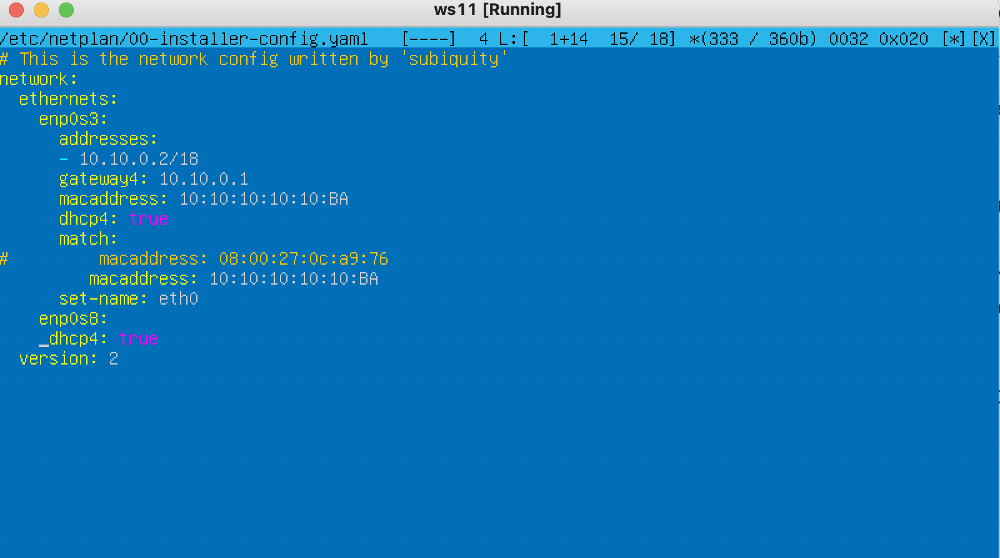
##### Для r1 настроить аналогично r2, но сделать выдачу адресов с жесткой привязкой к MAC-адресу (ws11). Провести аналогичные тесты
- В отчёте этот пункт описать аналогично настройке для r2.
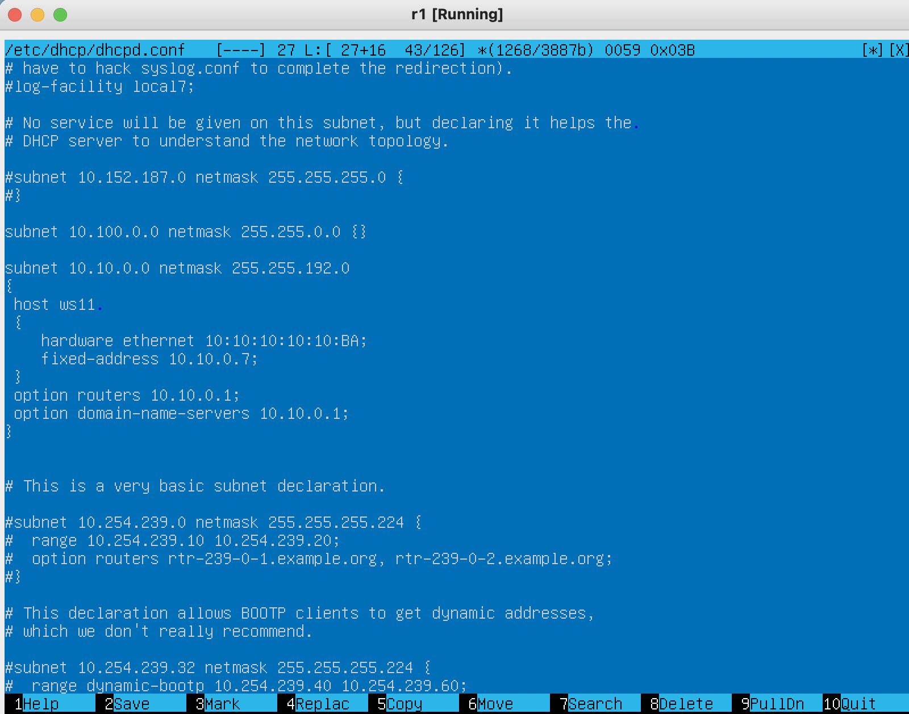
##### Запросить с ws21 обновление ip адреса
- В отчёте поместить скрины ip до и после обновления.
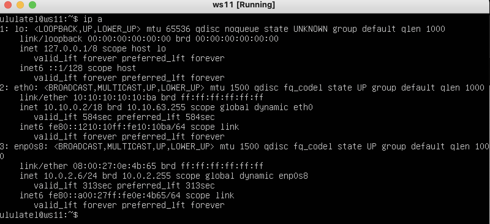
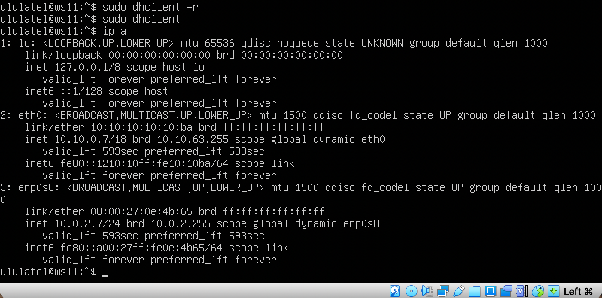
- В отчёте описать, какими опциями **DHCP** сервера пользовались в данном пункте.<br/>
Использовались функции привязки фиксированного ip-адреса по конкретному MAC-адресу.
## Part 7. **NAT**
##### В файле */etc/apache2/ports.conf* на ws22 и r2 изменить строку `Listen 80` на `Listen 0.0.0.0:80`, то есть сделать сервер Apache2 общедоступным
- В отчёт поместить скрин с содержанием изменённого файла.
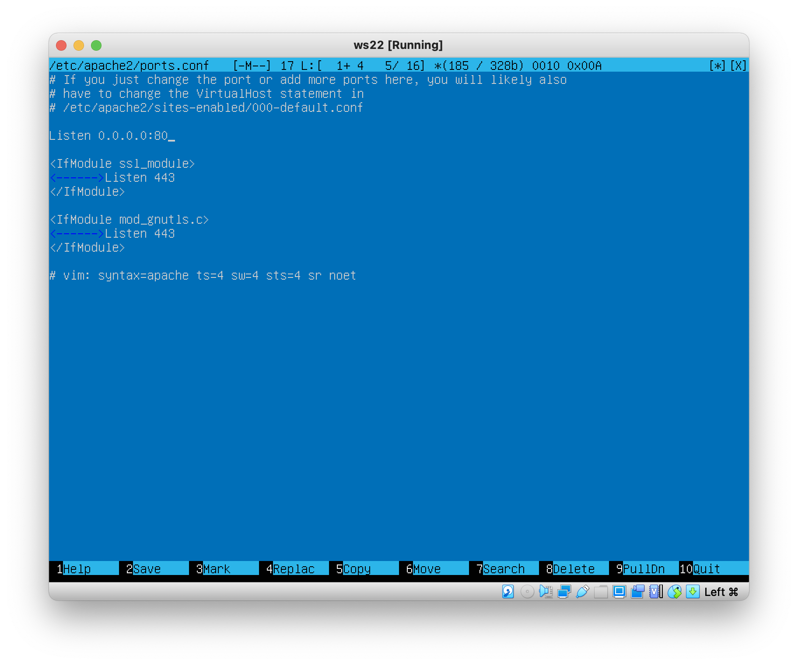

##### Запустить веб-сервер Apache командой `service apache2 start` на ws22 и r1
- В отчёт поместить скрины с вызовом и выводом использованной команды.
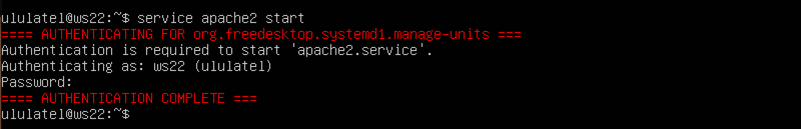
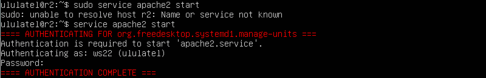
##### Добавить в фаервол, созданный по аналогии с фаерволом из Части 4, на r2 следующие правила:
##### 1) Удаление правил в таблице filter - `iptables -F`
##### 2) Удаление правил в таблице "NAT" - `iptables -F -t nat`
##### 3) Отбрасывать все маршрутизируемые пакеты - `iptables --policy FORWARD DROP`
##### Запускать файл также, как в Части 4
##### Проверить соединение между ws22 и r1 командой `ping`
*При запуске файла с этими правилами, ws22 не должна "пинговаться" с r1*
- В отчёт поместить скрины с вызовом и выводом использованной команды.
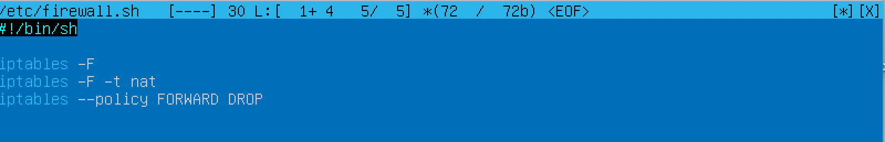
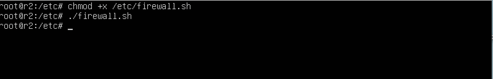
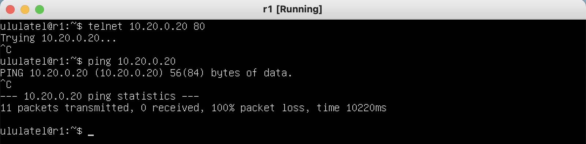
##### Добавить в файл ещё одно правило:
##### 4) Разрешить маршрутизацию всех пакетов протокола **ICMP**
##### Запускать файл также, как в Части 4
##### Проверить соединение между ws22 и r1 командой `ping`
*При запуске файла с этими правилами, ws22 должна "пинговаться" с r1*
- В отчёт поместить скрины с вызовом и выводом использованной команды.
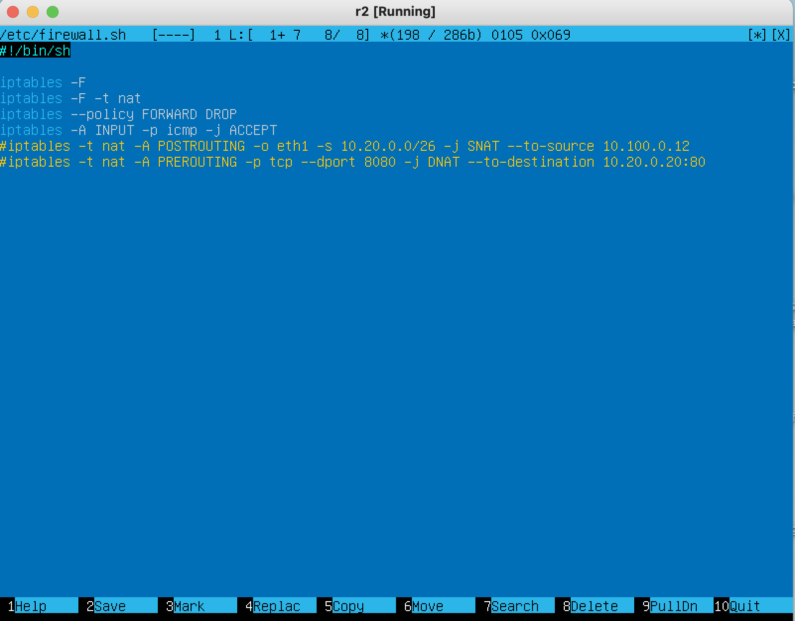
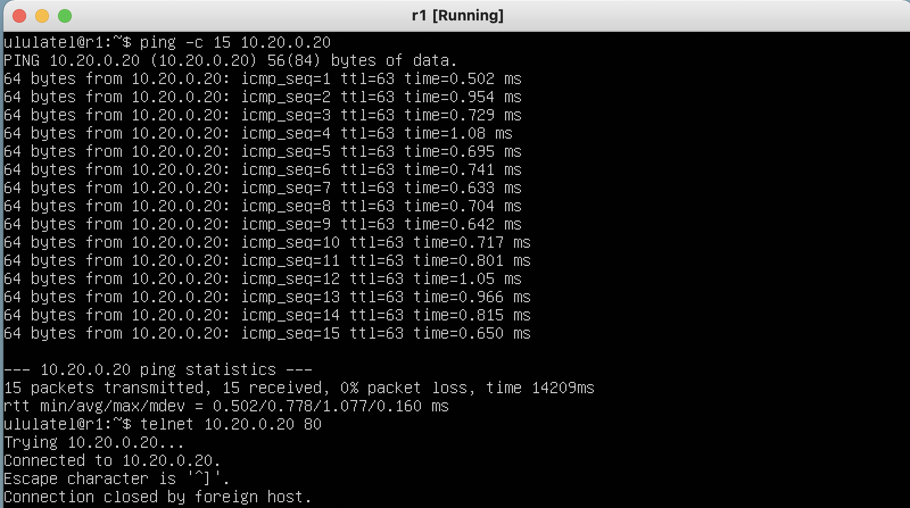
##### Добавить в файл ещё два правила:
##### 5) Включить **SNAT**, а именно маскирование всех локальных ip из локальной сети, находящейся за r2 (по обозначениям из Части 5 - сеть 10.20.0.0)
*Совет: стоит подумать о маршрутизации внутренних пакетов, а также внешних пакетов с установленным соединением*
##### 6) Включить **DNAT** на 8080 порт машины r2 и добавить к веб-серверу Apache, запущенному на ws22, доступ извне сети
*Совет: стоит учесть, что при попытке подключения возникнет новое tcp-соединение, предназначенное ws22 и 80 порту*
- В отчёт поместить скрин с содержанием изменённого файла.
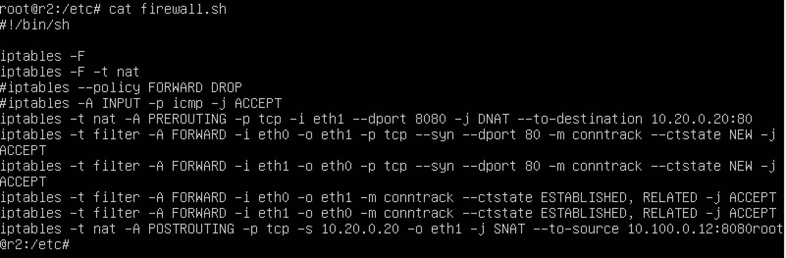
##### Запускать файл также, как в Части 4
*Перед тестированием рекомендуется отключить сетевой интерфейс **NAT** (его наличие можно проверить командой `ip a`) в VirtualBox, если он включен*
##### Проверить соединение по TCP для **SNAT**, для этого с ws22 подключиться к серверу Apache на r1 командой:
`telnet [адрес] [порт]`
##### Проверить соединение по TCP для **DNAT**, для этого с r1 подключиться к серверу Apache на ws22 командой `telnet` (обращаться по адресу r2 и порту 8080)
- В отчёт поместить скрины с вызовом и выводом использованных команд.
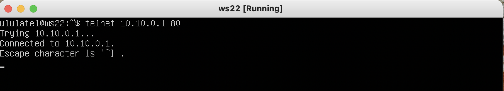


## Part 8. Дополнительно. Знакомство с **SSH Tunnels**
##### Запустить веб-сервер **Apache** на ws22 только на localhost (то есть не изменять файл */etc/apache2/ports.conf* или, если был изменен ранее, вернуть строку `Listen 80`)
##### Воспользоваться *Local TCP forwarding* с ws21 до ws22, чтобы получить доступ к веб-серверу на ws22 с ws21
##### Воспользоваться *Remote TCP forwarding* c ws11 до ws22, чтобы получить доступ к веб-серверу на ws22 с ws11
##### Для проверки, сработало ли подключение в обоих предыдущих пунктах, перейдите во второй терминал (например, клавишами Alt + F2) и выполните команду:
`telnet 127.0.0.1 [локальный порт]`
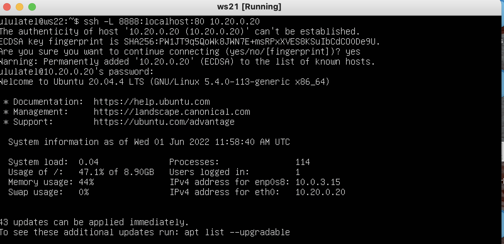
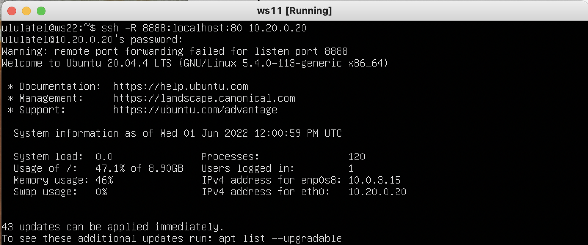
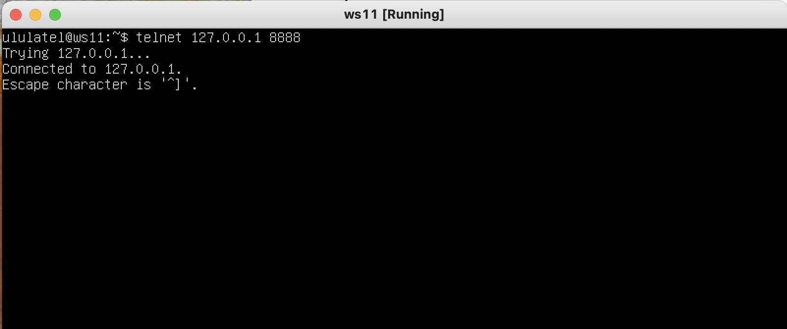
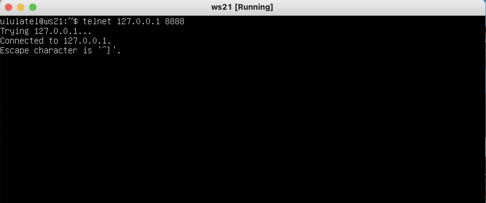


