# LINUX DAY 02.

## Part 1.

### 1.1 Сети и маски.

#### 1)
* IP dec: 192.167.38.54/13
* IP bin: 11000000.10100 111.00100110.00110110
* Mask: 255.248.0.0 = 13 = 11111111.11111 000.00000000.00000000
* Net: 192.160.0.0/13 = 110 00000.10100 000.00000000.00000000

#### 2)
* Mask_1 dec: 255.255.255.0 
* Mask_1 bin: 11111111.11111111.11111111.00000000
* Mask_1 pref: /24

* Mask_2 pref: /15
* Mask_2 dec: 255.254.0.0
* Mask_2 bin: 11111111.11111110.00000000.00000000

* Mask_3 bin: 11111111.11111111.11111111.11110000
* Mask_3 dec: 255.255.255.240
* Mask_3 pref: /28

#### 3)
* IP dec: 12.167.38.4
* IP bin: 00001100.10100111.00100110.00000100

* Mask_1 pref: /8
* Mask_1 bin: 11111111.00000000.00000000.00000000
* Net_1 dec: 12.0.0.0
* Host_1 dec: 0.167.38.4

* Mask_2 bin: 11111111.11111111.00000000.00000000
* Net_2 dec: 12.167.0.0
* Host_2 dec: 0.0.38.4 - Min host

* Mask_3 dec: 255.255.254.0
* Mask_3 bin: 11111111.11111110.00000000.00000000
* Net_3 bin: 00001100.10100110.00000000.00000000
* Net_3 dec: 12.166.0.0
* Host_3 dec: 0.1.38.4

* Mask_4 pref: /4
* Mask_4 bin: 11110000.00000000.00000000.00000000
* Net_4 dec: 0.0.0.0
* Host_4 dec: 12.167.38.4 - Max host

* Max host: 12.167.38.4
* Min host: 0.0.38.4

### 1.2 localhost.

localhost (так называемый, «местный» от англ. local, или «локальный хост», по смыслу — этот компьютер) — в компьютерных сетях, стандартное, официально зарезервированное доменное имя для частных IP-адресов (в диапазоне 127.0.0.1 — 127.255.255.254, RFC 2606). Для сети, состоящей только из одного компьютера, как правило, используется всего один адрес — 127.0.0.1, который устанавливается на специальный сетевой интерфейс «внутренней петли» (англ. loopback) в сетевом протоколе TCP/IP. В Unix-подобных системах данный интерфейс обычно именуется «loN», где N — число, либо просто «lo». При установке соединений в этой вырожденной «сети» присутствует только один компьютер, при этом сетевые протоколы выполняют функции протоколов межпроцессного взаимодействия.

Использование адреса 127.0.0.1 позволяет устанавливать соединение и передавать информацию для программ-серверов, работающих на том же компьютере, что и программа-клиент, независимо от конфигурации аппаратных сетевых средств компьютера (не требуется сетевая карта, модем, и прочее коммуникационное оборудование, интерфейс реализуется при помощи драйвера псевдоустройства в ядре операционной системы). Таким образом, для работы клиент-серверных приложений на одном компьютере не требуется изобретать дополнительные протоколы и дописывать программные модули. Примером может быть запущенный на компьютере веб-сервер и обращение к нему с этого компьютера для веб-разработки на этом компьютере без необходимости выкладывать веб-программу в сеть интернет, пока её разработка не закончена.

Традиционно адресу 127.0.0.1 однозначно сопоставляется имя хоста «.localhost» и/или «localhost.localdomain», то есть, по умолчанию, присутствует перенаправление на себя. Есть также рекомендации к использованию специальных доменных имен, таких как .test, .example и .invalid.(RFC 2606), но они еще не вошли в практику и традиционно еще по умолчанию не настроены.

* Можно обратиться к адресам: 127.0.0.2, 127.1.0.1

* Нельзя обратиться к адресам: 194.34.23.100, 128.0.0.1

### 1.3 Диапазоны и сегменты сетей.

#### 1)

* Частные (серые IP адреса): 
* * 10.0.0.0 - 10.255.255.255 Mask: /8 or 255.0.0.0
* * 172.16.0.0 - 172.31.255.255 Mask: /12 or 255.240.0.0
* * 192.16.0.0 - 192.168.255.255 Mask: /16 or 255.255.0.0

Частные: 10.0.0.45, 192.168.4.2, 172.20.250.4, 172.16.255.255, 10.10.10.10

Публичные: 134.43.0.2, 172.0.2.1, 192.172.0.1, 172.68.0.2, 192.169.168.1

#### 2)

IP: 10.10.0.0/18

Обычно должен стоять адресс шлюза у которого в несетевой части стоит 1, но фактически может быть любой другой адрес в машинной части.

Шлюзы: 10.10.0.2, 10.10.10.10, 10.10.1.255

## Part 2.

### Вывод команды: ip a.

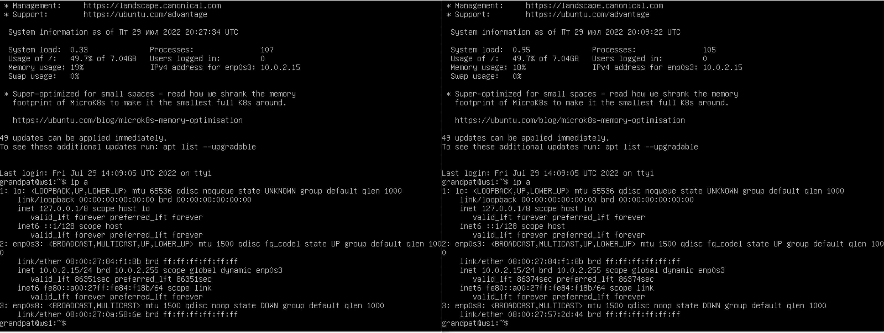

### Cкриншоты измененного файла etc/netplan/00-installer-config.yaml для каждой машины.

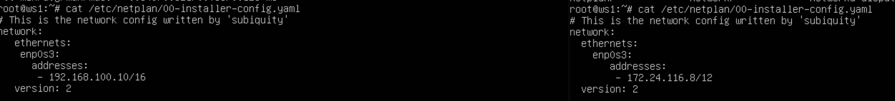

### netplan apply && ip a

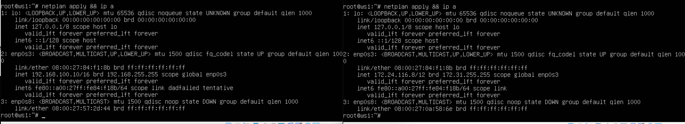

### 2.1 Добавление статического маршрута вручную: ip r add.

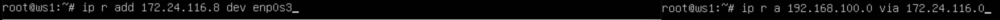

Пингование адресов без сохранения.

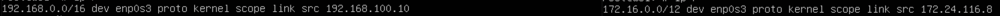

### 2.2 Добавление статического маршрута с сохранением.

Изменённый файла `etc/netplan/00-installer-config.yaml`.

Пингование адресов с сохранением.

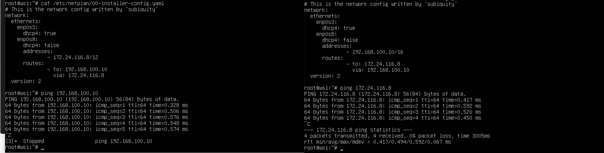

## Part 3.

### 3.1 Скорость соединения.

8 Mbps = 1 MB/s
100 MB/s = 80 000 Kbps
1 Gbps = 1000 Mbps

### 3.2 Утилита iperf3.

Вывод команды `iperf3`.

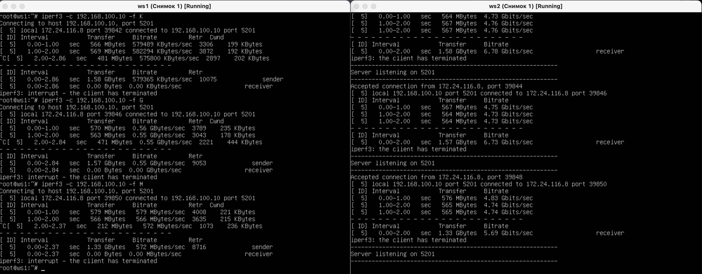

## Part 4.

### 4.1 Утилита iptables.

* Содержимое файла `/etc/firewall.sh` для каждой машины.

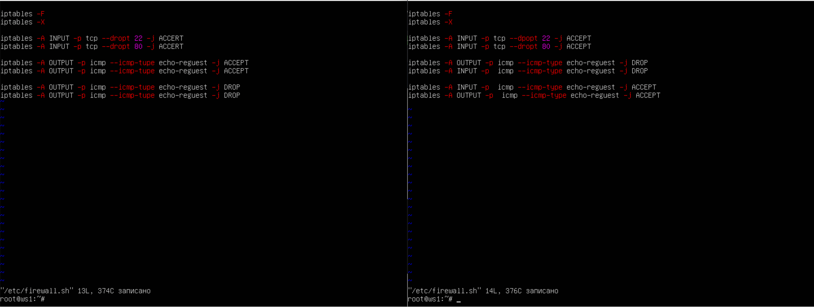

* Запускаем файлы и проверяем условие на пинг машин.

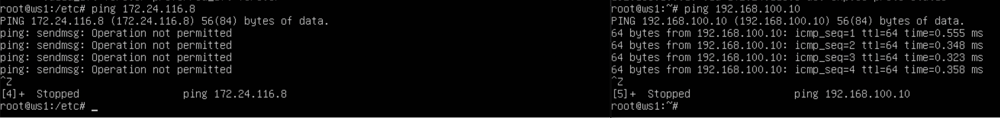

* DROP — молча игнорирует пакет и прекращает обработку правил в этой цепочке.
* ACCEPT — принимает пакет и останавливает обработку правил в этой цепочке.

### 4.2 Утилита nmap.

* Вызов и вывод использованных команд `ping` и `nmap`.

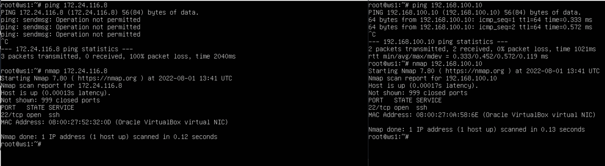

## Part 5.

### 5.1 Настройка адресов машин.

* Содержание файла `etc/netplan/00-installer-config.yaml` для каждой машины.

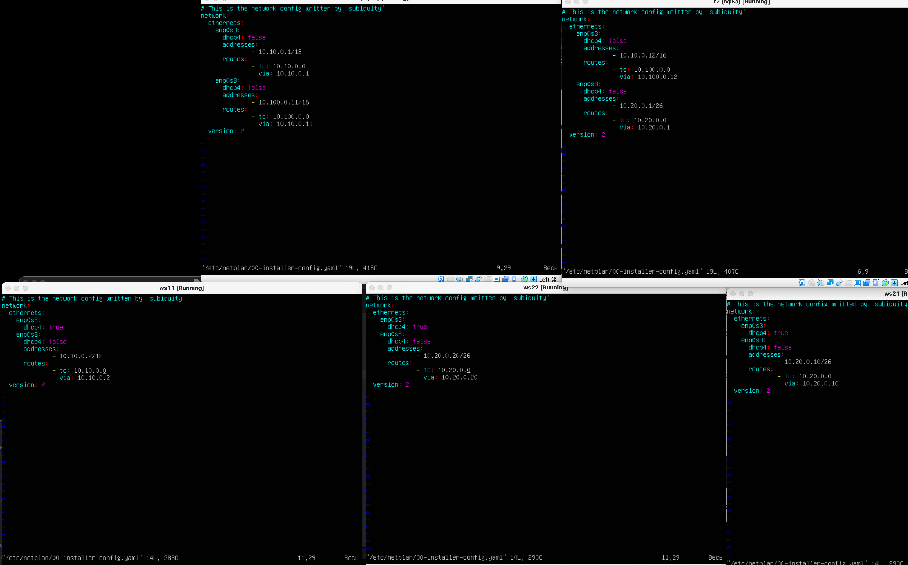

* Перезапустить сервис сети. Если ошибок нет, то командой `ip -4 a` проверить, что адрес машины задан верно.

* Пропинговать `ws22` с `ws21`.

* Аналогично пропинговать `r1` с `ws11`.

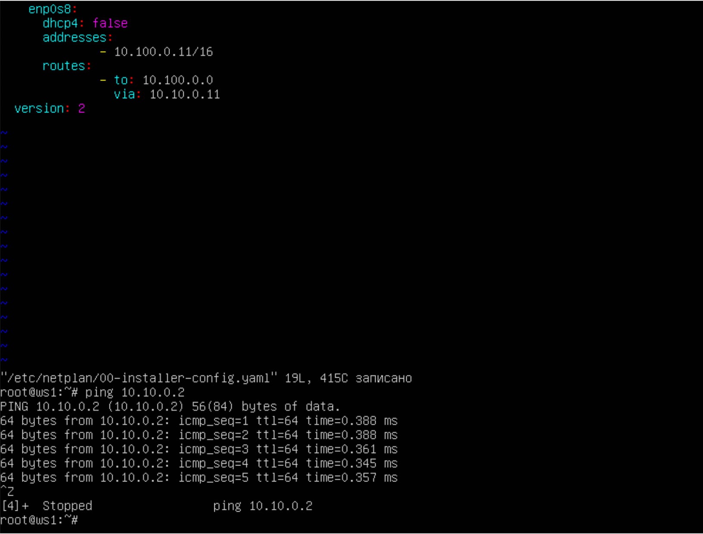

## 5.2 включение переадресации IP - адресов.

Для включения переадресации IP, выполните команду на роутерах:
 
`sysctl -w net.ipv4.ip_forward=1`

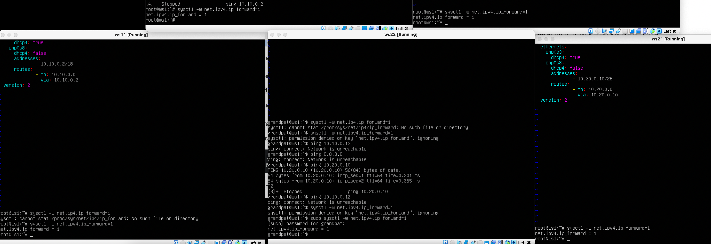

Откройте файл `/etc/sysctl.conf` и добавьте в него следующую строку:

`net.ipv4.ip_forward = 1`

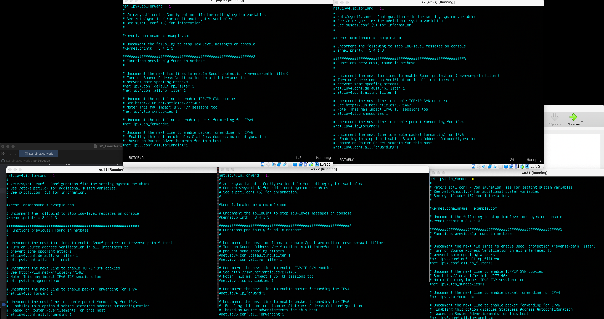

## 5.3 Установка маршрута по-умолчанию.

* Настроить маршрут по-умолчанию (шлюз) для рабочих станций. Для этого добавить gateway4 [ip роутера] в файле конфигураций.

* Вызвать `ip r` и показать, что добавился маршрут в таблицу маршрутизации.

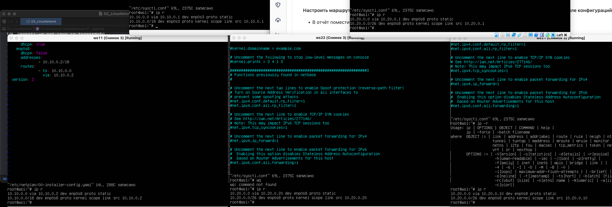

Пропинговать с `ws11` роутер `r2` и показать на `r2`, что пинг доходит. Для этого использовать команду:

`tcpdump -tn -i eth1`

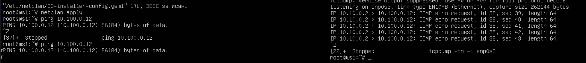

## 5.4 Добавление статических маршрутов.

* Добавить в роутеры `r1` и `r2` статические маршруты в файле конфигураций.

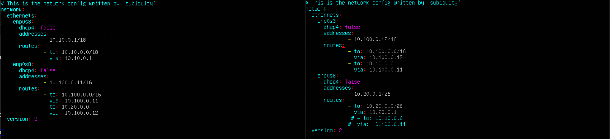

* Вызвать ip r и показать таблицы с маршрутами на обоих роутерах.

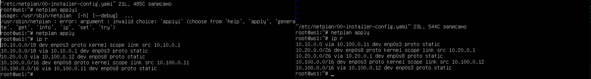

* Запустить команды на `ws11`.

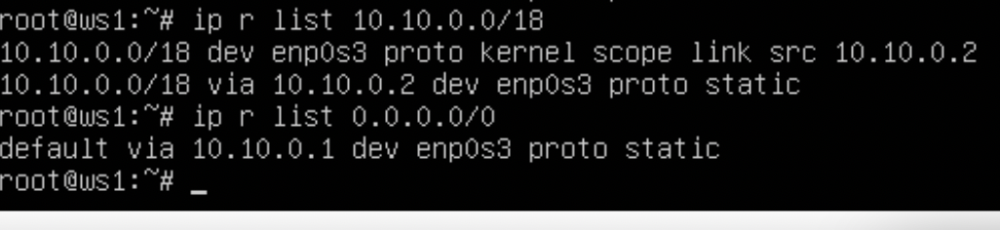

___В отчёте объяснить, почему для адреса 10.10.0.0/[порт сети] был выбран маршрут, отличный от 0.0.0.0/0, хотя он попадает под маршрут по-умолчанию.___

* Потому что приоритетно выбирается маршрут с более длинной маской как более точное решение.

## 5.5 Построение списка маршрутизаторов.

* При помощи утилиты traceroute построить список маршрутизаторов на пути от `ws11` до `ws21`.

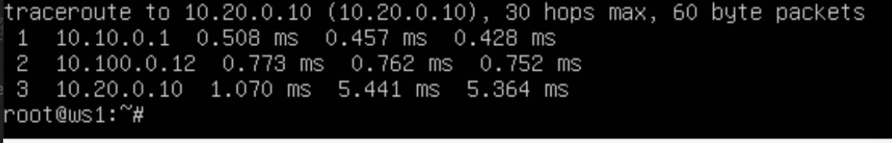

## 5.6 Использование протокола ICMP при маршрутизации.

* Запустить на `r1` перехват сетевого трафика, проходящего через eth0 с помощью команды:

`tcpdump -n -i eth0 icmp`

* Пропинговать с `ws11` несуществующий IP (например, 10.30.0.111) с помощью команды:

`ping -c 1 10.30.0.111`

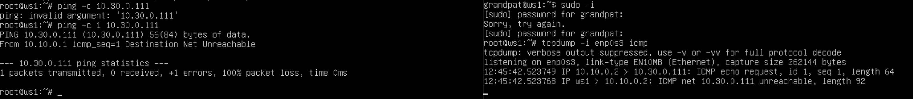

## Part 6.

* Для `r2` настроить в файле `/etc/dhcp/dhcpd.conf` конфигурацию службы DHCP:

1) Указать адрес маршрутизатора по-умолчанию, DNS-сервер и адрес внутренней сети.

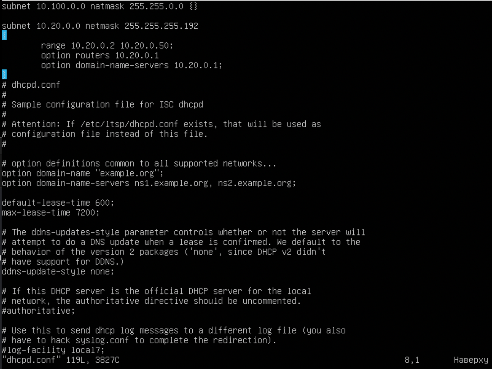

2) В файле `resolv.conf` прописать `nameserver 8.8.8.8`.

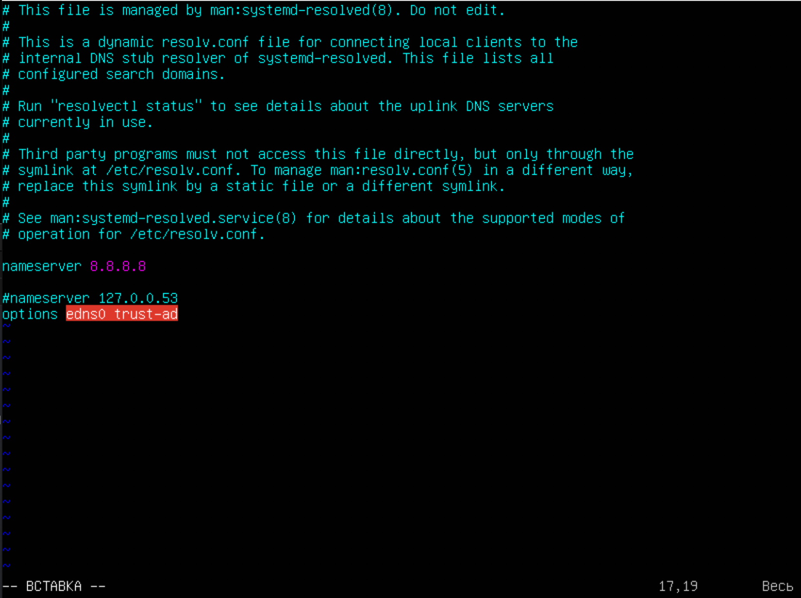

* Перезагрузить службу DHCP командой `systemctl restart isc-dhcp-server`. Машину `ws21` перезагрузить при помощи `reboot` и через `ip a` показать, что она получила адрес. Также пропинговать `ws22` с `ws21`.

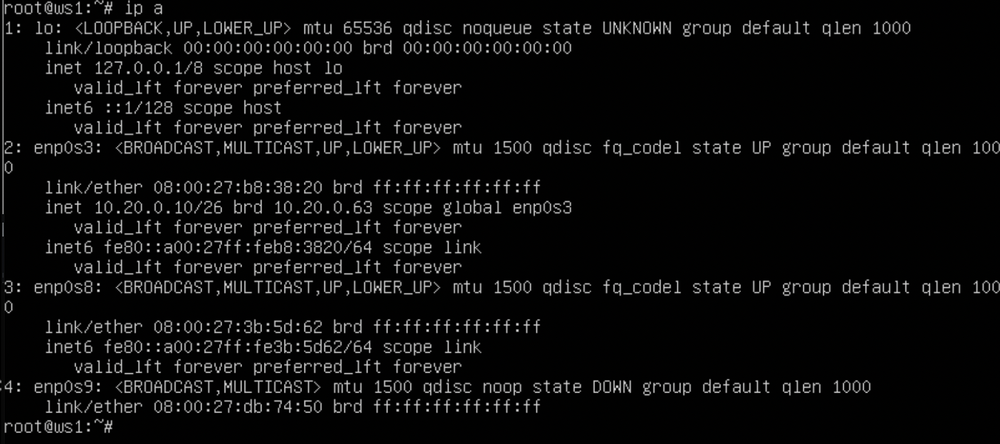

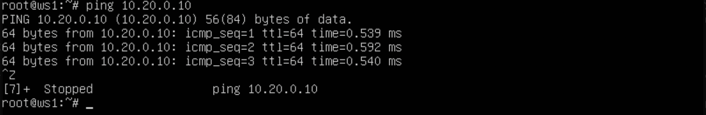

* Указать MAC адрес у `ws11`, для этого в `etc/netplan/00-installer-config.yaml` надо добавить строки:

`macaddress: 10:10:10:10:10:BA`
`dhcp4: true`

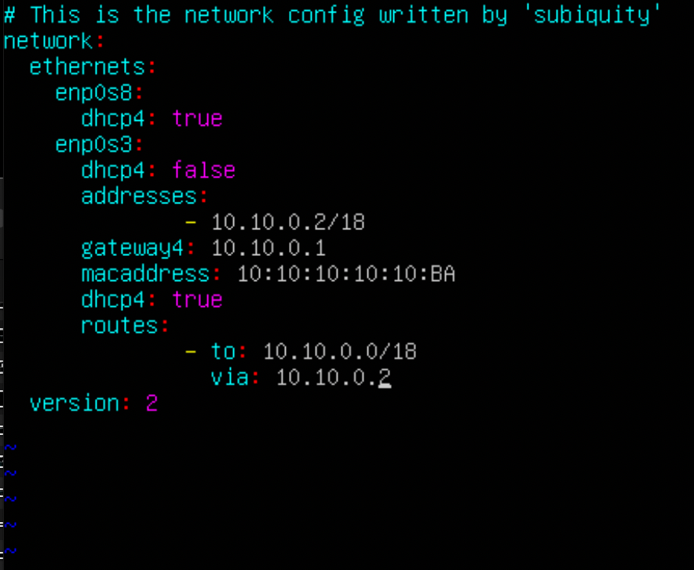

* Для `r1` настроить аналогично `r2`, но сделать выдачу адресов с жесткой привязкой к MAC-адресу `ws11`. Провести аналогичные тесты.

* Запросить с `ws11` обновление ip адреса.

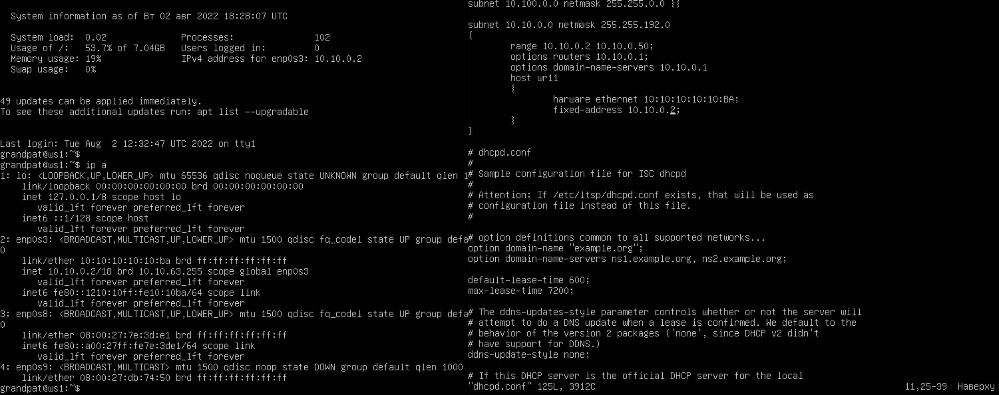

 * В отчёте описать, какими опциями DHCP сервера пользовались в данном пункте.

Изменяли ip на фиксированный при помощи привязки к MAC адрессу.

## Part 7

* В файле `/etc/apache2/ports.conf` на `ws22` и `r2` изменить строку `Listen 80` на `Listen 0.0.0.0:80`, то есть сделать сервер `Apache2` общедоступным.

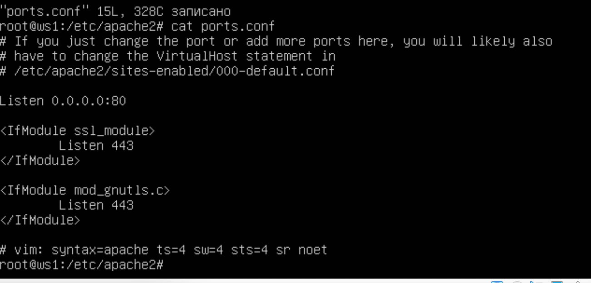

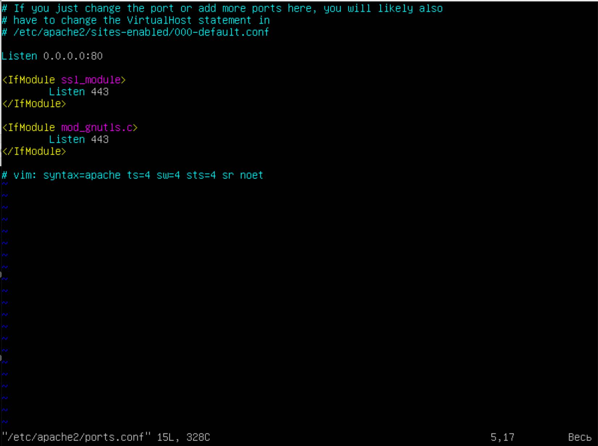

* Запустить веб-сервер Apache командой `service apache2 start` на `ws22` и `r1`.

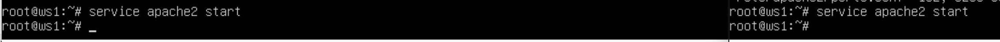

1) Удаление правил в таблице filter: `iptables -F`.

2) Удаление правил в таблице "NAT": `iptables -F -t nat`.

3) Отбрасывать все маршрутизируемые пакеты: `iptables --policy FORWARD DROP`.

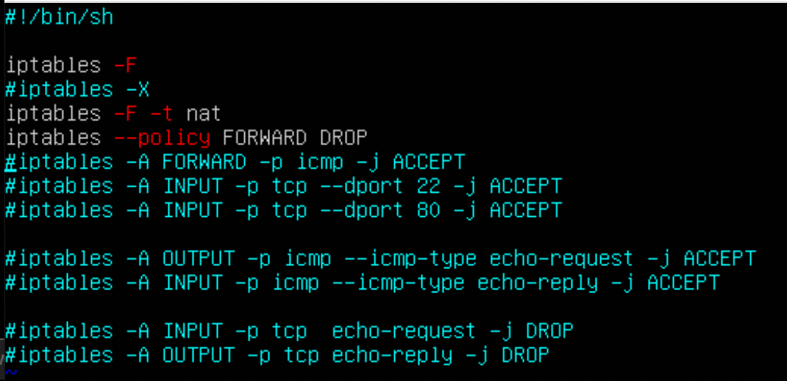

При запуске файла с этими правилами, `ws22` не должна "пинговаться" с `r1`.

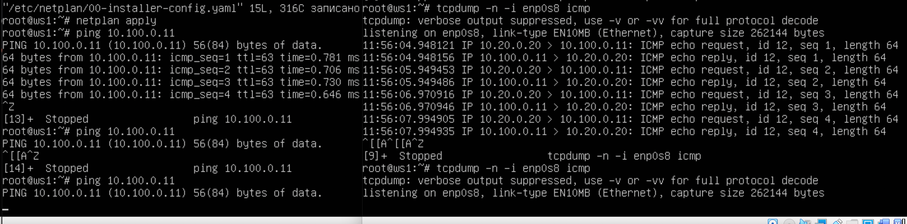

4) Разрешить маршрутизацию всех пакетов протокола ICMP.

Проверить соединение между `ws22` и `r1` командой `ping`.

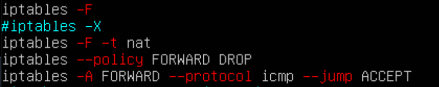

При запуске файла с этими правилами, `ws22` должна "пинговаться" с `r1`.

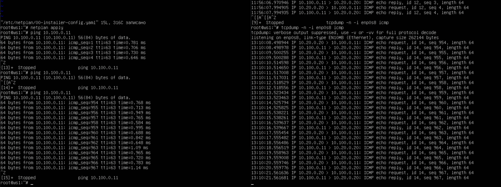

5) Включить SNAT, а именно маскирование всех локальных ip из локальной сети, находящейся за `r2` (по обозначениям из Части 5 - сеть 10.20.0.0).

6) Включить DNAT на 8080 порт машины `r2` и добавить к веб-серверу Apache, запущенному на `ws22`, доступ извне сети.

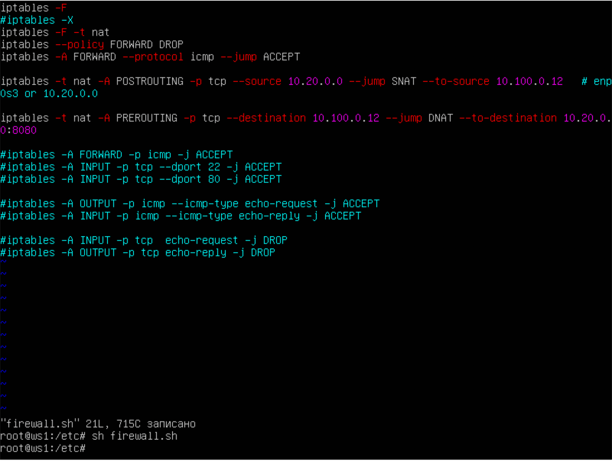

Проверить соединение по TCP для SNAT, для этого с `ws22` подключиться к серверу Apache на `r1` командой: `telnet [address] [port]`.

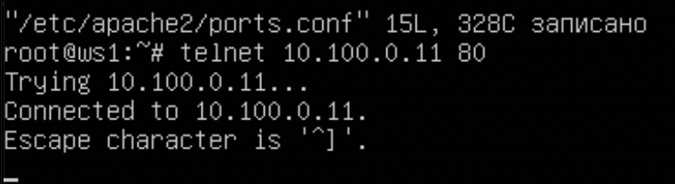

Проверить соединение по TCP для DNAT, для этого с `r1` подключиться к серверу Apache на `ws22` командой `telnet`

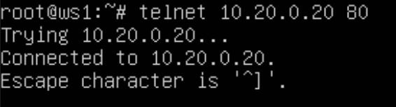

## Part 8

Запустить веб-сервер Apache на `ws22` только на localhost (то есть не изменять файл `/etc/apache2/ports.conf` или, если был изменен ранее, вернуть строку Listen 80).

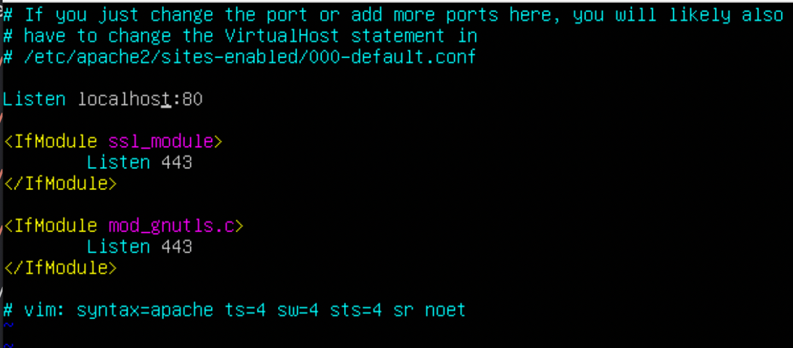

Воспользоваться Local TCP forwarding с `ws21` до `ws22`, чтобы получить доступ к веб-серверу на `ws22` с `ws21`.

Воспользоваться Remote TCP forwarding c `ws11` до `ws22`, чтобы получить доступ к веб-серверу на `ws22` с `ws11`.

на `ws22` с `ws21`

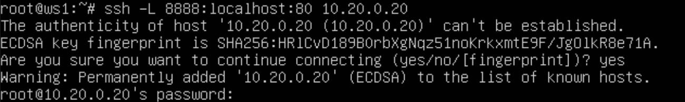

на `ws22` с `ws11`

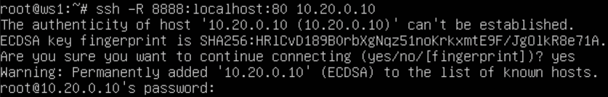

telnet

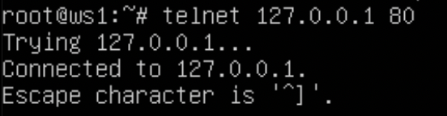

* В отчёте описать команды, необходимые для выполнения этих четырёх пунктов, а также приложить скриншоты с их вызовом и выводом.

ssh -L 8888:localhost:80 10.20.0.20
ssh -R 8888:localhost:80 10.20.0.20
telnet 127.0.0.1
